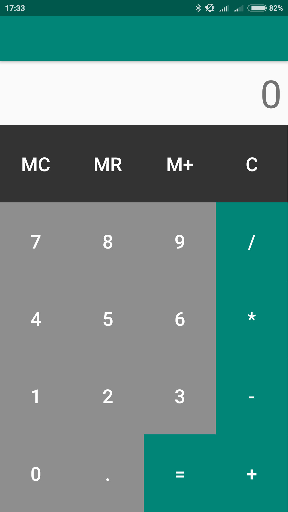
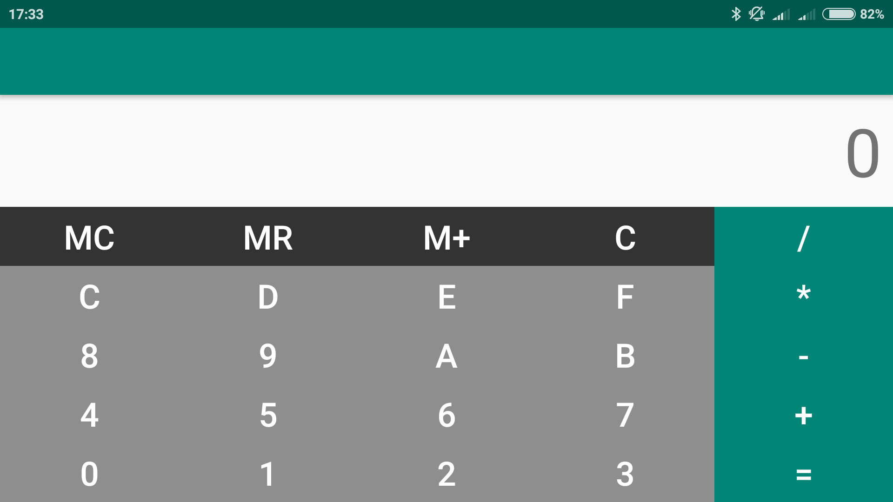

**Calculator Android**

Calculadora básica realizada con Android Studio bajo lenguaje Kotlin

**Orientación portrait**

Calculadora decimal, operaciones acumulativas, memoria.
	

**Orientación landscape**

Calculadora hexadecimal, con las mismas características que en portrait.

